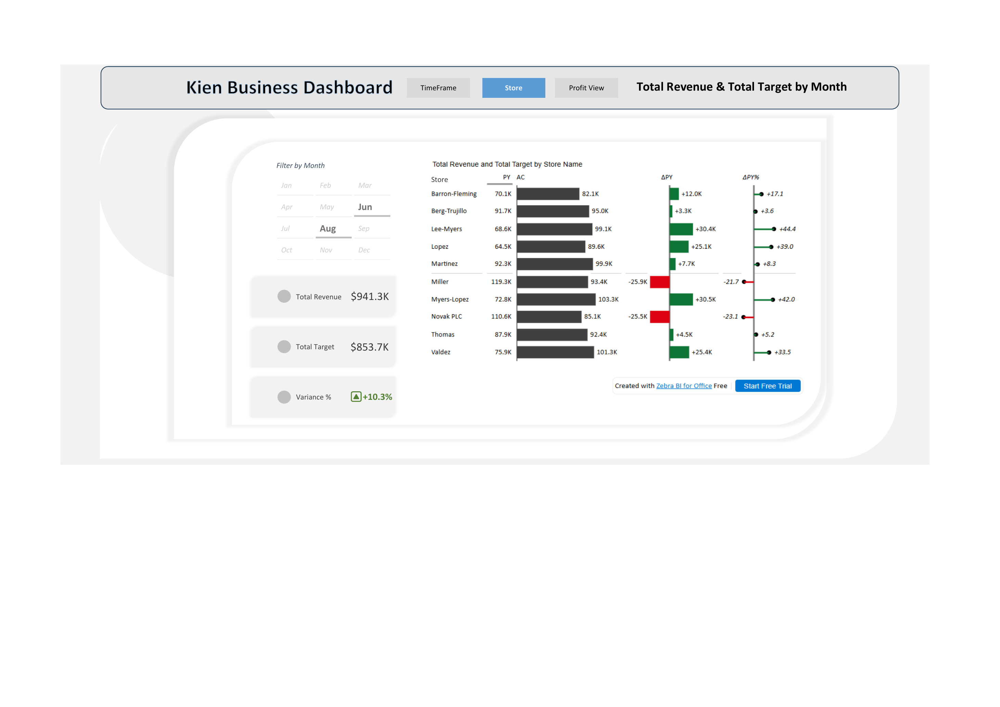
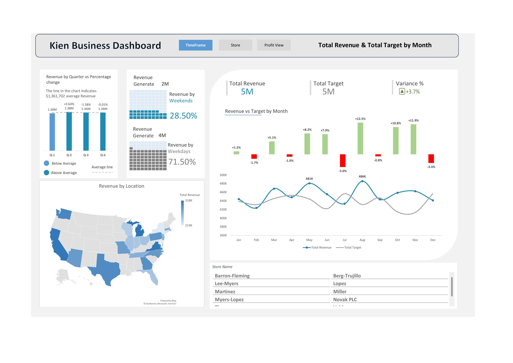
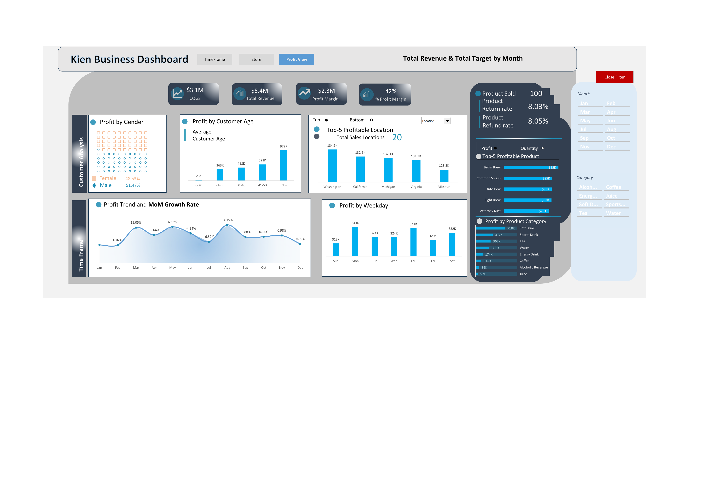

# Business Sales & Profit Performance Dashboard

A multi-page Power BI dashboard tracking revenue, targets, and profitability across 10 stores and 20 sales locations, with drill-down views for time trends, store-level variance, and product/category profit contribution — useful for supply and distribution network performance reviews.

## Business Questions Answered
- Which stores are exceeding vs. missing revenue targets, and by how much?
- How does revenue trend month over month, and how does it compare to target?
- What share of revenue comes from weekdays vs. weekends?
- Which locations and product categories are most profitable?
- How does profit vary by customer demographic (age, gender)?

## Key Metrics
| Metric | Value |
|---|---|
| Total Revenue | $5.4M |
| Total Target | $5M |
| Profit Margin | $2.3M (42%) |
| COGS | $3.1M |
| Sales Locations | 20 |
| Product Return Rate | 8.03% |

## Dashboard Views

### 1. Store View

Store-by-store comparison of prior-year vs. actual revenue, with variance (ΔPY) called out — 4 of 10 stores underperformed against prior year, flagged in red for quick triage.

### 2. TimeFrame View

Revenue vs. target trended by month, with quarterly breakdown and a weekday/weekend revenue split (71.5% weekday / 28.5% weekend) — relevant for staffing and replenishment scheduling.

### 3. Profit View

Profit broken down by product category, top-5 profitable locations/products, and profit trend with month-over-month growth rate — supports category-level and location-level margin analysis.

## Key Insights
- **4 of 10 stores (Miller, Novak PLC) underperformed prior-year revenue by ~$25K+ each**, while top performers like Lee-Myers and Lopez grew 30%+ — highlighting uneven performance across the store network worth investigating.
- **Soft drinks and sports drinks drive the largest share of profit** by product category, useful for prioritizing inventory and shelf space.
- **Weekday sales account for over 70% of revenue**, informing staffing and stock replenishment timing.
- Washington and California are the top two profit-generating locations, just ahead of Michigan, Virginia, and Missouri.

## Tools Used
- Microsoft Power BI (DAX, multi-page report design, drill-through filters)

## Files
- `Project_4.xlsx` — full interactive dashboard file
- `Project_Sales_Dashboard_Final.pdf` — exported dashboard views
- `screenshot1.png` / `screenshot2.png` / `screenshot3.png` — dashboard preview images
